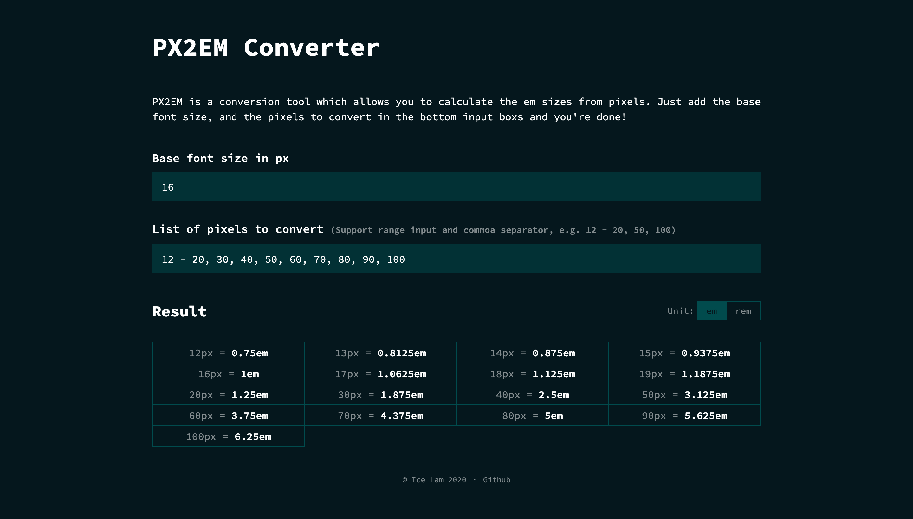

    

# PX2EM Converter #
PX2EM is a conversion tool which allows you to calculate the em sizes from pixels.

## Features ##
1. Convert pixels to rem by providing base font size
2. Store inputs for re-visiting users
3. Copy to clipboard by clicking on the data cell

## Tech Stack ##
* [React](https://reactjs.org/)
* [styled-components](https://www.styled-components.com/)
* [Jest](https://jestjs.io/)
* [Enzyme](https://enzymejs.github.io/enzyme/)
* [Storybook](https://storybook.js.org/)

## Setup ##
Below shows some basic setup steps.

### Node version ###
This project is developed using Node.js 12. The version is already specified in the `.nvmrc` file. Suggest to run `nvm use` when you enter the project folder.

### Install packages need for the project ###
Install yarn packages in project root folder first using `yarn install`.

### To start the project ##
Run `yarn start` in project root folder.

### To build production ###
Run `yarn run build` in project root folder.

### To start Storybook ###
Run `yarn storybook` in project root folder.

### To build Storybook ###
Run `yarn build-storybook` in project root folder.

### To run unit tests ###
Run `yarn test` in the project root folder.

## Configurations ##
Below shows some available configuration options.

### To add / edit Webpack alias ###
To add or edit Webpack alias, the following files must be modified in order to have ESLint, Jest and Storybook to work correctly.
1. Modify the `import/resolver.node.alias.map` node in `.eslintrc` 
2. Modify `config.resolve.alias` in `config-overrides.js`
3. Modify `jest.moduleNameMapper` in `package.json`
4. Modify `config.resolve.alias` in `.storybook/main.js`

### To change the app host and public url used in <meta> tags ###
The `REACT_APP_APP_HOST` and `PUBLIC_URL` are located in `.env` and `.env.development` files.

### To add Google Tag Manager ID ###
The `REACT_APP_GTM_ID` are located in `.env` and `.env.development` files.
